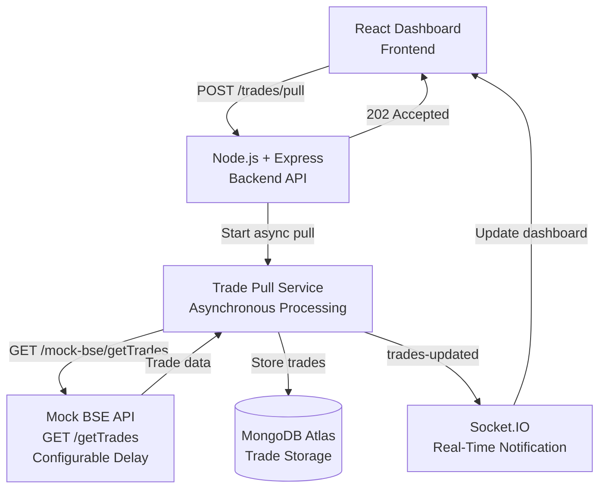

# Architecture

## System Architecture

## Request Flow

1. The user opens the React dashboard.
2. The dashboard loads existing trades using `GET /trades`.
3. The user clicks **Pull Latest Trades**.
4. React sends `POST /trades/pull` to the Express backend.
5. The backend immediately returns `202 Accepted`.
6. The Trade Pull Service continues the operation asynchronously.
7. The service calls the Mock BSE API, which simulates the long-running request using a configurable delay.
8. The retrieved trades are stored in MongoDB Atlas.
9. The backend emits a `trades-updated` event through Socket.IO.
10. The React dashboard receives the event and loads the latest trades.
11. The table updates automatically without page refresh or polling.

## Why This Design?

The BSE API can take up to 15 minutes to complete, while the network may terminate an HTTP connection after approximately 30 seconds. Keeping the browser request open for the entire operation would therefore be unreliable.

The application solves this using an asynchronous request pattern:

* The frontend receives an immediate `202 Accepted` response.
* The backend continues the trade pull independently.
* MongoDB provides persistent storage for the retrieved trades.
* Socket.IO notifies the dashboard when the pull completes.
* No frontend polling loop or cron job is required.

This keeps the dashboard responsive while the long-running trade pull is processed.

## Technology Stack

| Component               | Technology               |
| ----------------------- | ------------------------ |
| Frontend                | React + Vite             |
| Backend                 | Node.js + Express        |
| Database                | MongoDB Atlas + Mongoose |
| Real-Time Communication | Socket.IO                |
| HTTP Client             | Axios                    |
| Mock BSE API            | Express                  |

## Key Components

| Component          | Responsibility                                |
| ------------------ | --------------------------------------------- |
| React Dashboard    | Displays trades and starts trade pulls        |
| Express API        | Handles REST requests                         |
| Trade Pull Service | Performs the long-running BSE pull            |
| Mock BSE API       | Simulates the BSE trade API                   |
| MongoDB Atlas      | Stores trade records                          |
| Socket.IO          | Notifies the dashboard when new trades arrive |
